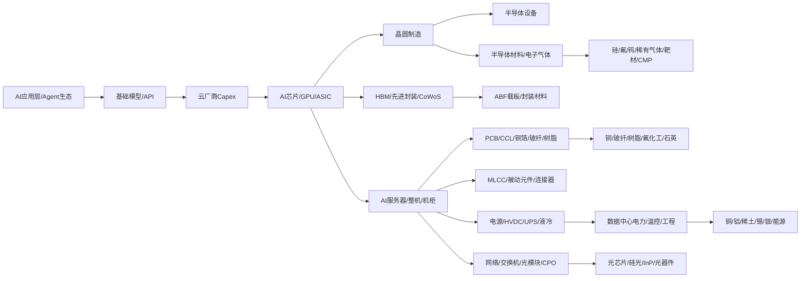

# AI全产业链地图

> [!warning] 使用边界
> 本页是 AI 产业链图谱总索引，用于建立认知结构和后续 Web 站点关系地图。公司名单只代表产业位置，不代表买点；A股映射必须继续验证客户、订单、收入占比、毛利率和估值消化。

## 概念定义

AI全产业链地图，是把大模型应用和云厂商资本开支向上游拆解成：模型/云服务、AI芯片、晶圆制造、半导体设备、半导体材料、HBM与先进封装、服务器整机、PCB/CCL/被动元件、光通信/网络、电源/液冷、数据中心工程、资源品和基础原料。

交易认知上的核心问题不是“AI受益股有哪些”，而是：

1. 哪个环节是真实瓶颈。
2. 哪个环节能涨价或扩产。
3. 哪家公司有收入纯度和客户认证。
4. 哪些只是被舆情标签映射。

## C版站点主图谱

## 一级产业链总览

| 层级 | 核心问题 | 海外核心企业 | 国内/大中华核心企业 | 交易验证重点 |
| --- | --- | --- | --- | --- |
| AI应用与云Capex | 谁在买算力 | Microsoft/OpenAI、Amazon、Google、Meta、Oracle、xAI、Anthropic | 阿里、腾讯、百度、字节、华为云、火山引擎 | Capex、GPU订单、数据中心建设节奏 |
| AI应用/Agent | 谁在形成收入和推理需求 | OpenAI、Microsoft、Google、Anthropic、Salesforce、ServiceNow、Adobe、Cursor | 百度、阿里、腾讯、字节、金山办公、科大讯飞、用友、金蝶 | 付费率、ARR、留存、推理调用量 |
| AI芯片/GPU/ASIC | 算力平台和单卡价值量 | NVIDIA、AMD、Broadcom、Marvell、Intel、Google TPU、AWS Trainium、Microsoft Maia | 华为昇腾、寒武纪、海光信息、百度昆仑芯、燧原、壁仞、摩尔线程 | 产品性能、生态、客户、供给约束 |
| 晶圆制造 | 先进制程和产能 | TSMC、Samsung Foundry、Intel Foundry、GlobalFoundries | 中芯国际、华虹公司 | 先进制程产能、良率、客户排产 |
| 半导体设备 | EUV/刻蚀/沉积/检测 | ASML、Applied Materials、Lam Research、KLA、Tokyo Electron、ASM International | 北方华创、中微公司、拓荆科技、华海清科、盛美上海、芯源微、精测电子、长川科技 | 设备订单、国产替代、先进制程/先进封装暴露 |
| 半导体材料 | 芯片制造耗材和瓶颈 | Shin-Etsu、SUMCO、JSR、TOK、DuPont、Merck、Entegris、Linde、Air Liquide、JX Metals | 沪硅产业、TCL中环、安集科技、江丰电子、鼎龙股份、华特气体、金宏气体、昊华科技、雅克科技、晶瑞电材 | 规格、客户认证、国产替代、价格 |
| HBM/存储 | AI加速器带宽瓶颈 | SK hynix、Samsung Electronics、Micron | 长鑫存储、兆易创新、澜起科技、聚辰股份 | HBM代际、出货、封装协同、内存接口 |
| 先进封装 | HBM与GPU集成瓶颈 | TSMC CoWoS/SoIC、ASE、Amkor、Intel、Samsung、BESI、ASMPT | 长电科技、通富微电、华天科技、甬矽电子、深南电路、兴森科技、华海诚科、德邦科技 | CoWoS产能、ABF载板、底填/塑封料、设备 |
| AI服务器/整机 | 订单兑现入口 | Dell、HPE、Supermicro、Lenovo、Quanta、Wiwynn、Foxconn、Wistron | 工业富联、浪潮信息、中科曙光、紫光股份 | 客户订单、毛利率、供应链议价 |
| PCB/CCL | 高速高层板和材料升级 | Panasonic、Isola、Rogers、Mitsui、JX Metals、Nittobo、AGC、Taiwan Glass | 沪电股份、胜宏科技、深南电路、鹏鼎控股、生益科技、华正新材、金安国纪、德福科技、铜冠铜箔 | 高端板占比、CCL等级、铜箔/玻纤/树脂提价 |
| MLCC/被动元件 | 高容高可靠和电源BOM | Murata、TDK、Taiyo Yuden、Samsung Electro-Mechanics、Yageo | 三环集团、风华高科、国瓷材料、洁美科技、博迁新材、火炬电子、宏达电子 | 高端规格、车规/AI规格、粉体/镍粉/离型膜 |
| 光通信/网络 | 集群互联瓶颈 | Broadcom、Marvell、NVIDIA Spectrum-X、Arista、Cisco、Coherent、Lumentum | 中际旭创、新易盛、天孚通信、光迅科技、仕佳光子、源杰科技、剑桥科技、罗博特科 | 800G/1.6T出货、CPO节奏、硅光、光器件 |
| 电源/液冷/IDC | 电力和散热瓶颈 | Vertiv、Schneider Electric、Eaton、ABB、Delta、Johnson Controls、CoolIT | 英维克、申菱环境、高澜股份、科华数据、科士达、麦格米特、中恒电气、依米康 | 单柜功率、液冷渗透、HVDC/UPS订单 |
| 原料/资源品 | 成本和长期供需 | Freeport、BHP、Rio Tinto、Alcoa、MP Materials、Glencore | 紫金矿业、中国铝业、北方稀土、江西铜业、云南铜业、锡业股份、洛阳钼业、中国巨石、中材科技 | 铜铝稀土锡银价格、库存、矿山成本 |

## 关键下钻页

| 下钻页 | 解决的问题 | 本页中的位置 |
| --- | --- | --- |
| [[AI应用层与Agent生态]] | 通用助手、办公、代码、客服、营销、行业应用和Agent商业化 | 应用层/需求源头 |
| [[AI芯片HBM与先进封装]] | GPU/ASIC、HBM、CoWoS、ABF、封装材料和设备 | AI芯片、HBM、先进封装 |
| [[AI半导体材料与原料全景]] | 硅片、电子气体、光刻胶、靶材、CMP、封装材料及上游原料 | 半导体材料和原料 |
| [[AI数据中心电源液冷与HVDC]] | 高功率机柜、电源、UPS/HVDC、液冷和IDC工程 | 电源/液冷/数据中心 |
| [[AI服务器PCB提价链]] | 高端PCB、CCL、铜箔、电子布、树脂、钻针 | PCB/CCL |
| [[CPO与1.6T硅光光模块]] | 光模块、CPO/NPO、硅光、光器件和光通信设备 | 光通信/网络 |
| [[MLCC设备国产替代]] | 高端MLCC材料、设备、制造和耗材 | 被动元件 |
| [[有色金属AI电力需求链]] | 铜、铝、稀土、锡、银和电力投资 | 原料/资源品 |

## 材料与原料拆解

| 产业环节 | 直接材料 | 上游原料 | 海外核心企业 | 国内核心企业 | 验证点 |
| --- | --- | --- | --- | --- | --- |
| 先进制程 | 硅片、光刻胶、电子气体、靶材、CMP抛光液/垫 | 高纯硅、稀有气体、氟化工、钨、铜、钽、铝 | Shin-Etsu、SUMCO、JSR、TOK、Merck、Entegris、DuPont、JX Metals、Linde | 沪硅产业、安集科技、江丰电子、鼎龙股份、华特气体、金宏气体、昊华科技 | 规格认证、客户导入、国产替代 |
| HBM/封装 | ABF载板、底填、EMC、临时键合材料、TSV相关材料 | 环氧树脂、BT/ABF树脂、硅、铜、锡银焊料 | Ajinomoto、Resonac、NAMICS、Shinko、Ibiden、Unimicron、ASE/Amkor | 深南电路、兴森科技、华海诚科、德邦科技、长电科技、通富微电 | CoWoS/2.5D产能、封装材料订单 |
| PCB/CCL | 高速覆铜板、低损耗树脂、铜箔、电子布、PP、钻针、油墨 | 铜、玻纤、环氧/PPE/PTFE树脂、钨钴、氟化工 | Panasonic、Isola、Rogers、AGC、Nittobo、Mitsui、JX Metals | 生益科技、华正新材、金安国纪、胜宏科技、沪电股份、德福科技、铜冠铜箔、中国巨石 | 材料等级、涨价函、客户认证 |
| MLCC | 陶瓷粉体、镍粉、铜粉、离型膜、载带、浆料 | 钛、钡、镍、铜、PET基膜 | Murata、TDK、Taiyo Yuden、Samsung Electro-Mechanics、Yageo | 三环集团、风华高科、国瓷材料、博迁新材、洁美科技 | 高容高可靠规格、客户、ASP |
| 光通信 | InP/硅光芯片、透镜、隔离器、光纤、石英耗材 | 磷、铟、高纯石英、稀土掺杂材料 | Coherent、Lumentum、II-VI/Coherent、Corning、Fujikura | 中际旭创、新易盛、天孚通信、光迅科技、仕佳光子、源杰科技、凯德石英 | 800G/1.6T订单、硅光平台、良率 |
| 液冷/电源 | 冷板、泵、CDU、连接器、UPS/HVDC、功率器件 | 铜、铝、不锈钢、氟化冷却液、SiC/GaN材料 | Vertiv、Schneider、Delta、Eaton、CoolIT、ABB | 英维克、申菱环境、高澜股份、科华数据、麦格米特、中恒电气 | 单柜功率、液冷订单、客户项目 |

## 国内外核心企业对照

| 主线 | 海外锚 | 国内锚 | 交易上先看什么 |
| --- | --- | --- | --- |
| GPU/AI加速器 | NVIDIA、AMD | 华为昇腾、寒武纪、海光信息 | 性能、生态、客户订单、供应链可得性 |
| ASIC/网络芯片 | Broadcom、Marvell | 百度昆仑芯、壁仞、燧原、芯原股份 | 定制芯片订单、代工和封装能力 |
| HBM | SK hynix、Samsung、Micron | 长鑫存储、澜起科技、兆易创新 | HBM代际、接口芯片、内存控制 |
| 先进封装 | TSMC、ASE、Amkor | 长电科技、通富微电、华天科技、华海诚科 | CoWoS/2.5D能力、材料订单 |
| 高速PCB/CCL | Panasonic、Isola、Rogers | 沪电股份、胜宏科技、生益科技、深南电路 | 高速高频材料、客户认证、毛利率 |
| 光模块/CPO | Coherent、Lumentum、Broadcom、Arista | 中际旭创、新易盛、天孚通信、光迅科技 | 800G/1.6T出货和CPO节奏 |
| 电源液冷 | Vertiv、Schneider、Delta、Eaton | 英维克、申菱环境、高澜股份、科华数据 | 高功率机柜订单和液冷渗透 |
| 原料资源 | Freeport、BHP、Rio Tinto、MP Materials | 紫金矿业、中国铝业、北方稀土、江西铜业 | 商品价格、库存、成本和政策 |

## 证据强度与权限

| 证据 | 可做什么 | 不可做什么 |
| --- | --- | --- |
| 官方产品/年报/公告 | 建立产业位置和长期趋势 | 不能直接映射到A股订单 |
| 微信舆情/复盘摘要 | 发现市场关注和题材扩散 | 不能当事实或买点 |
| 公司公告/定期报告 | 验证收入、订单、产能、客户 | 不能忽略估值和周期 |
| 价格/库存/招标数据 | 验证涨价和供需 | 不能孤立使用，需结合公司成本 |

## 优先验证清单

- [ ] 云厂商 Capex 是否继续上修，是否对应真实 GPU/ASIC/服务器订单。
- [ ] HBM、CoWoS、ABF载板是否仍是供给瓶颈。
- [ ] 高速PCB和CCL是否有明确提价、客户认证和毛利改善。
- [ ] 光模块 800G/1.6T 出货是否兑现，CPO/NPO是否影响可插拔模块估值。
- [ ] 液冷和电源订单是否与高功率机柜绑定，是否有收入确认。
- [ ] 原料价格上涨是否增厚资源股利润，还是吞噬下游材料厂利润。
- [ ] 国内替代是否已进入量产客户，还是停留在题材标签。

## 资料与证据

| 来源 | 可用信息 | 使用方式 |
| --- | --- | --- |
| [NVIDIA GB200 NVL72 官方资料](https://www.nvidia.com/en-us/data-center/gb200-nvl72/) | Blackwell AI服务器平台、NVLink和高功率机柜背景 | AI服务器需求背景 |
| [NVIDIA 投资者季度资料](https://investor.nvidia.com/financial-info/quarterly-results/default.aspx) | 数据中心收入和AI基础设施需求 | Capex趋势背景 |
| [TSMC 3DFabric/CoWoS 官方资料](https://3dfabric.tsmc.com/english/dedicatedFoundry/technology/cowos.htm) | CoWoS先进封装平台 | HBM/先进封装背景 |
| [Micron HBM 官方资料](https://www.micron.com/products/memory/hbm) | HBM与AI内存需求 | HBM背景 |
| [SK hynix HBM 官方资料](https://www.skhynix.com/products.do?ct1=50&ct2=52&lang=eng) | HBM产品线 | HBM背景 |
| [AMD Instinct 官方资料](https://www.amd.com/en/products/accelerators/instinct.html) | AI加速器竞争格局 | AI芯片背景 |
| [ASML 年报资料](https://www.asml.com/en/investors/annual-report) | EUV和先进制程设备 | 半导体设备背景 |
| [Applied Materials 投资者资料](https://ir.appliedmaterials.com/) | 半导体设备和先进封装趋势 | 设备背景 |
| [Ajinomoto ABF 官方资料](https://www.ajinomoto.com/innovation/keyword/abf) | ABF载板材料 | 封装材料背景 |
| [Panasonic MEGTRON 官方资料](https://industrial.panasonic.com/ww/products/pt/megtron) | 高速低损耗CCL材料 | PCB材料背景 |
| [Vertiv AI数据中心资料](https://www.vertiv.com/en-us/solutions/ai-hub/) | AI数据中心电源和冷却 | 电源液冷背景 |
| [Schneider Electric AI数据中心资料](https://www.se.com/us/en/work/solutions/for-business/data-centers-and-networks/artificial-intelligence/) | AI数据中心基础设施 | 电力冷却背景 |

## 2026-06-15 今日新增下钻

| 新增节点 | 所属位置 | 为什么纳入 | 验证重点 |
| --- | --- | --- | --- |
| [[MPO光互联连接器]] | 光通信/网络/布线 | AI集群提高光纤端口密度，MPO/MT插芯从光模块链路中独立出来 | 连接器、插芯、跳线产品和客户认证 |
| [[HVLP高端铜箔]] | PCB/CCL材料 | 高速高频PCB需要低轮廓铜箔，不能和普通锂电铜箔混看 | HVLP等级、CCL导入、收入占比 |
| [[硅电容与先进封装去耦]] | AI芯片/先进封装/被动元件 | 高功耗AI芯片对电源完整性和封装内去耦要求提高 | 是否为硅电容/IPD，而不是普通MLCC外溢 |
| [[ABF增层膜与高端载板]] | HBM/先进封装/封装基板 | AI芯片扩大ABF材料和高端载板需求 | 区分ABF膜、ABF载板和普通PCB |
| [[制冷剂与氟化液冷]] | 数据中心电源液冷/化工材料 | 制冷剂涨价与AI液冷冷却液被舆情混合，需要拆分 | 产品牌号、客户项目、配额和价格 |
| [[AI版支付宝与金融生活智能体]] | AI应用层/Agent | 超级App可能从功能入口演化为任务执行入口 | 官方发布、工具调用、合规和商业模式 |

## 结论

AI产业链应按“云Capex -> 芯片/HBM/封装 -> 服务器/网络/PCB/电源液冷 -> 材料/原料”逐级验证。C版可视化站点的主关系图应以本页为根节点，所有概念页和股票页围绕节点关系展开，而不是只按文件夹平铺。
