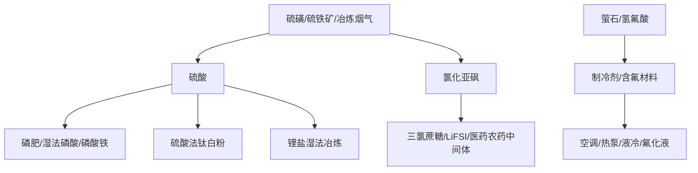

# 化工材料涨价链全景

## 概念定义

化工材料涨价链，是把化工品价格上涨拆成“上游原料涨价、产品现货涨价、下游被迫提价、公司利润弹性”四层。它不能只看涨价幅度，更要看公司处在资源端、制酸端、加工端还是下游消化端。

截至 2026-06-14，本轮最值得优先补入知识库的是[[硫磺硫酸涨价链]]：硫磺供给偏紧和价格大涨，传导到硫酸、钛白粉、磷化工、氯化亚砜、锂盐湿法冶炼等多个化工分支。

## 当前涨价强度分层

| 层级 | 品种/链条 | 当前处理 | 事实强度 | 交易权限 |
| --- | --- | --- | --- | --- |
| A 强涨价主线 | [[硫磺硫酸涨价链]] | 重点跟踪 | 中高 | observe_only |
| A 强涨价主线 | 硫磺 | 上游原料，价格弹性最强，但A股纯度分散 | 中高 | observe_only |
| A 强涨价主线 | 硫酸 | 已进入日榜涨幅前列，且产业链指数创高 | 中高 | observe_only |
| B 传导涨价 | 钛白粉 | 硫酸法成本抬升后，产品提价能否覆盖成本是核心 | 中 | observe_only |
| B 传导涨价 | 磷肥/湿法磷酸/磷化工 | 硫酸需求强，但对下游也可能是成本压力 | 中 | observe_only |
| B 传导涨价 | 氯化亚砜 | 硫磺、液氯等成本支撑，需看产品售价和价差 | 中 | observe_only |
| B 传导涨价 | 碳酸锂/氢氧化锂 | 生意社日榜出现工业级碳酸锂上涨，更多是锂价自身供需和硫酸成本共同作用 | 中 | observe_only |
| C 中期景气 | 制冷剂 R32/R125/R134a | 配额约束和龙头控产支撑，偏供给制度型景气 | 中 | observe_only |
| C 短期观察 | TDI、烧碱、湿法磷酸、炭黑、苯酚、PA6 | 可能阶段性上涨，需逐一看价差、库存和开工 | 中低 | observe_only |
| 暂不纳入主线 | 溴素、异丙醇、DMAC、环氧乙烷 | 近期榜单或公开信息显示偏弱/回调，不作为当前涨价主线 | 中 | no_action |

## 产业链传导

## 重点品种梳理

| 品种 | 为什么涨 | 受益方向 | 可能受损方向 | 核心验证 |
| --- | --- | --- | --- | --- |
| 硫磺 | 供给弹性小、进口依赖高、地缘和运输扰动、库存偏紧 | 炼化副产硫磺、库存低位持货方 | 买硫磺制酸/下游消化差的企业 | 港口库存、进口量、成交价、地缘持续性 |
| 硫酸 | 硫磺成本推升、部分制酸装置检修、磷肥/新能源/湿法冶炼需求 | 冶炼酸和低成本制酸企业 | 外购酸的钛白粉、磷化工、锂盐企业 | 区域价格、酸厂开工、下游接受度 |
| 钛白粉 | 硫酸法成本上涨倒逼提价 | 具备定价权、氯化法占比高或成本优势企业 | 成本无法转嫁企业 | 钛白粉报价、开工率、出口、硫酸成本 |
| 磷化工 | 磷肥、湿法磷酸、磷酸铁用酸需求支撑 | 自有磷矿、自配硫酸、产品涨价顺畅企业 | 外购硫酸且产品涨价慢企业 | 磷酸一铵/二铵、黄磷、湿法磷酸价差 |
| 氯化亚砜 | 硫磺、液氯等原料抬升，部分下游如三氯蔗糖、LiFSI提供需求 | 具备成本转嫁能力的龙头 | 低价库存耗尽后的下游 | 产品价格、原料价差、产能开工、环保约束 |
| 制冷剂 | HFC配额制度、供给集中、龙头控产和下游刚需 | 巨化股份、三美股份、永和股份、东岳集团等线索 | 下游空调/维修需求弱时价格承压 | 配额调整、R32/R125/R134a价格、库存、空调排产 |
| 碳酸锂/氢氧化锂 | 短期去库、需求韧性和硫酸成本扰动 | 锂资源/低成本锂盐 | 高成本外购矿加工 | 库存、期现价差、锂矿价格、需求排产 |

## A股映射框架

| 方向 | 代表公司线索 | 正面逻辑 | 需要反证 |
| --- | --- | --- | --- |
| 炼化副产硫磺 | 中国石化、中国石油、荣盛石化等 | 硫磺作为副产品涨价可能增厚边际收益 | 硫磺收入占比通常低，不能高估弹性 |
| 冶炼酸/硫酸销售 | 铜陵有色、江西铜业、中金岭南等 | 冶炼副产硫酸价格上涨可能改善副产品收益 | 主利润仍取决于金属价格、加工费和冶炼成本 |
| 磷化工 | 云天化、兴发集团、湖北宜化、川恒股份、川发龙蟒 | 磷肥/湿法磷酸需求和价格若同步上涨，产业链一体化企业更稳 | 外购硫酸比例高则可能被成本侵蚀 |
| 钛白粉 | 龙佰集团、中核钛白、安纳达、金浦钛业 | 产品提价能否覆盖硫酸成本是关键 | 若硫酸成本涨快于钛白粉报价，利润反而受压 |
| 氯化亚砜 | 凯盛新材、金禾实业等 | 原料涨价若能顺价，产品价差可能改善 | 下游接受度和环保约束 |
| 制冷剂/氟化工 | 巨化股份、三美股份、永和股份、东岳集团、昊华科技 | 配额约束和供给集中支撑盈利 | 配额调整、需求不及预期、原料波动 |

## 和相关页面的区别

- [[周期资源与商品价格传导地图]]：大周期框架，本页是化工材料涨价下钻。
- [[材料强度高分子与电子材料]]：偏材料性能和应用，本页偏价格传导。
- [[半导体材料涨停潮]]：偏盘面归因，本页偏化工品现货和利润弹性。
- [[涨价链验证框架]]：通用验证方法，本页给出化工材料实例。

## 验证清单

- [ ] 涨价是现货成交、报价、长协价还是指数涨。
- [ ] 公司卖的是涨价品，还是买入涨价品。
- [ ] 是否有库存收益，还是库存耗尽后转为成本压力。
- [ ] 下游能不能接受提价，价差是否扩大。
- [ ] 公司收入纯度是否足够，不能只看题材标签。
- [ ] 供给扰动是短期事件还是长期结构。

## 2026-06-15 认知更新：制冷剂与氟化液冷

今天补入[[制冷剂与氟化液冷]]。化工材料涨价链里，制冷剂更多是配额和供需逻辑；AI液冷里的氟化冷却液更多是数据中心热管理材料逻辑。两者可以有公司重叠，但利润弹性和验证点不同。

| 方向 | 看什么 | 不能怎么写 |
| --- | --- | --- |
| 制冷剂涨价 | R32/R125/R134a价格、配额、库存、空调/汽车需求 | 不能直接等同于AI液冷 |
| 氟化冷却液 | 牌号、绝缘性、热稳定、客户项目、环保合规 | 不能只因公司有氟化工就认定受益 |
| 液冷系统 | 冷板、CDU、泵阀、数据中心项目 | 不能和化工品涨价混为一谈 |

## 引用来源

- [生意社：2026年6月12日化工大宗商品价格涨跌榜](https://top.100ppi.com/zdb/detail-day---14.html)
- [生意社：6月12日硫酸产业链情报](https://www.100ppi.com/data/detail-20260612-1228421.html)
- [21世纪经济报道：硫磺价格年内大增与产业链影响](https://www.21jingji.com/article/20260613/herald/5a823c24b96328eaa39f77562d343c7c.html)
- [生态环境部：2026年度HFCs配额总量设定与分配方案](https://www.mee.gov.cn/xxgk2018/xxgk/xxgk05/202510/W020251024653086234356.pdf)
